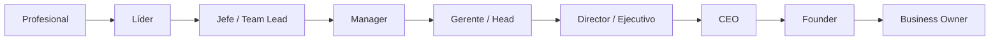
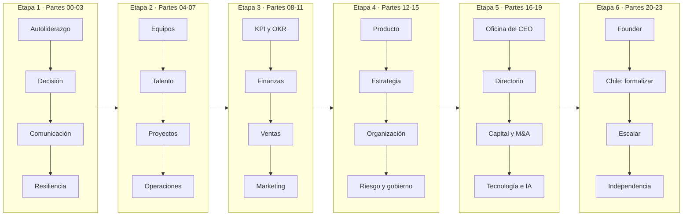

<div align="center">

# 👔 Executive Leadership & Founder Program

## **288 clases · 24 partes · 720 horas · de profesional individual a líder, gerente, CEO, founder y business owner**

**El programa ejecutivo más completo en español — desde asumir responsabilidad por un resultado propio hasta dirigir una empresa, sentarse en un directorio y crear la tuya, con una ruta de formalización e independencia en Chile.**

[](https://github.com/vladimiracunadev-create/executive-leadership-founder-program/actions/workflows/ci.yml)
[](https://github.com/vladimiracunadev-create/executive-leadership-founder-program/actions/workflows/security.yml)
[](https://vladimiracunadev-create.github.io/executive-leadership-founder-program/)

[](CHANGELOG.md)
[](SYLLABUS.md)
[](STATUS.md)
[](STATUS.md)
[](SYLLABUS.md)
[](LICENSE)

[](tools/)
[](docs/CHILE_FOUNDER_TRACK.md)
[](SYLLABUS.md)
[](https://vladimiracunadev-create.github.io/executive-leadership-founder-program/)

[🌐 **Portal de estudio**](https://vladimiracunadev-create.github.io/executive-leadership-founder-program/) ·
[📚 Temario de las 288 clases](SYLLABUS.md) ·
[🧭 Ruta de aprendizaje](docs/LEARNING_PATH.md) ·
[🚀 Primeros 90 días](docs/90_DAY_START.md) ·
[📖 Documentación](docs/README.md) ·
[🇨🇱 Founder Track Chile](docs/CHILE_FOUNDER_TRACK.md) ·
[📊 Estado](STATUS.md) ·
[🧾 Ficha técnica](MANIFEST.md) ·
[🗺️ Roadmap](ROADMAP.md) ·
[🤝 Contribuir](CONTRIBUTING.md) ·
[🔐 Seguridad](SECURITY.md)

</div>

---

> ⚖️ **Material formativo.** Este programa **no constituye asesoría legal, tributaria, financiera, laboral ni de inversión**, y completar sus clases **no concede un cargo ni una certificación profesional**. El material normativo chileno se presenta con su fecha de verificación y **exige revalidarse en la fuente oficial** antes de ejecutar cualquier trámite o decisión real. Detalle en [docs/ETHICS_AND_LIMITATIONS.md](docs/ETHICS_AND_LIMITATIONS.md).

---

> 🧭 **Estado del programa.** **Completo: las 6 etapas y sus 24 partes (288 clases) están construidas** — de aprender a responder por un resultado propio al capstone de business owner. Ninguna parte es un esqueleto.
>
> **Qué verifica una máquina y qué no**, para que sepas de qué te fías: la CI comprueba en cada `push` que las **288 clases** traigan sus 16 secciones obligatorias y sus referencias, que ninguna repita párrafos largos de otra ni se le parezca anormalmente, que **todos los enlaces relativos** resuelvan, y que ningún documento generado ([`SYLLABUS.md`](SYLLABUS.md), [`STATUS.md`](STATUS.md), [`FILE_INDEX.md`](FILE_INDEX.md), [`MANIFEST.md`](MANIFEST.md), el portal) esté desfasado. Lo que **no** verifica una máquina es la corrección conceptual de un argumento de gestión ni la vigencia de una norma citada: eso se apoya en la bibliografía y en la fecha de verificación que cada ficha declara.

## 🎯 Qué es esto

Un currículo modular y **secuencial** que recorre todo el espectro de la
responsabilidad ejecutiva, paso a paso, en 288 clases agrupadas en 24 partes y
6 etapas. Está diseñado para que **una misma persona** avance sin saltos desde
no tener a nadie a cargo hasta poder dirigir una empresa, defender una decisión
ante un directorio y construir una fuente propia de ingreso y propiedad.

No es una colección de apuntes ni de frameworks sueltos. Cada clase es una
carpeta con una **estructura fija verificada por integración continua**:

- 🎯 **Propósito** — qué dejó establecido la clase anterior y qué problema resuelve esta.
- 📚 **Resultados de aprendizaje** — seis resultados observables, no «conocer» ni «entender».
- 🧭 **Agenda** — los cinco tramos de la sesión, cada uno con su evidencia de aprendizaje.
- 🧩 **Conceptos centrales** — cinco términos con definición operacional y cómo demostrar que se entendieron.
- 🧠 **Modelo mental** — el método que ordena la clase, con su límite explícito.
- 📖 **Desarrollo** — seis o siete subsecciones sustantivas, una por concepto.
- 📚 **Lectura comparada** — dos obras contrastadas: dónde se complementan y dónde entran en tensión.
- 🧮 **Ejemplo trabajado**, 🔀 **comparación y límites** y 🪜 **de profesional a owner**.
- 🏢 **Caso ejecutivo** con información incompleta, 🧪 **práctica deliberada** y ⚠️ **errores frecuentes**.
- ❓ **Preguntas de comprobación**, 📥 **entregable** para el portafolio y 📗 **fuentes** con verificación.

> ### 🪜 La escalera de responsabilidad
>
> Es lo que hace que el programa sirva a los dos extremos del recorrido: **la misma clase que enseña a un profesional a proponer una decisión explica al futuro gerente cómo se decide, y al founder qué le cuesta esa decisión en caja.**

<div align="center">

| 📘 Clases | 🧪 Laboratorios | 🏢 Casos | 📝 Evaluaciones | 🎓 Proyectos | 📗 Obras | 🎮 Escenarios |
|:---:|:---:|:---:|:---:|:---:|:---:|:---:|
| **288** | **96** | **24** | **288** | **24** | **229** | **48** |

</div>

## 🎯 Salida profesional



El recorrido es **acumulativo**. Cada nivel añade una unidad de responsabilidad:

`yo → equipo → sistema → unidad de negocio → empresa → capital → propiedad`.

## 🗺️ Cómo progresa el programa



## 🗂️ Las 24 partes

Cada parte tiene su **propio README** con la narrativa completa: de qué trata,
resultado de salida, secuencia de las 12 clases, laboratorios, proyecto
integrador y bibliografía rectora. Las seis etapas se presentan aquí con el
mismo detalle porque las seis están completas.

### 🟢 Etapa 1 — Autoliderazgo y fundamentos ejecutivos

El punto de partida es la persona, no el cargo. Al terminarla decides con los
supuestos escritos, comunicas una decisión impopular sin perder al equipo y
sostienes criterio cuando la presión empuja a improvisar.
**Salida: Profesional → Líder.**

| # | Parte | Clases | Contenido central | README |
|---:|---|---:|---|---|
| 00 | De profesional a líder | 12 (001–012) | Liderar sin cargo formal, ownership, credibilidad, prioridades y sistema personal de ejecución | [📘 leer](modules/00-professional-to-leader/README.md) |
| 01 | Pensamiento crítico y toma de decisiones | 12 (013–024) | Formular el problema, sesgos, probabilidad, trade-offs, causa raíz y decision journal | [📘 leer](modules/01-critical-thinking-and-decisions/README.md) |
| 02 | Comunicación, influencia y presencia ejecutiva | 12 (025–036) | Escritura ejecutiva, presentaciones para decidir, feedback, conversaciones difíciles y stakeholders | [📘 leer](modules/02-communication-influence-negotiation-basics/README.md) |
| 03 | Inteligencia emocional, resiliencia y liderazgo adaptativo | 12 (037–048) | Autorregulación bajo presión, seguridad psicológica, problemas adaptativos y dilemas éticos | [📘 leer](modules/03-emotional-intelligence-resilience-adaptive-leadership/README.md) |

### 🔵 Etapa 2 — Liderazgo de equipos y ejecución

El salto de responder por uno mismo a responder por otros. Al terminarla tienes
un equipo con propósito y accountability, un sistema de talento del cargo a la
salida, y una operación que entrega sin depender de heroísmos.
**Salida: Líder → Jefe / Team Lead.**

| # | Parte | Clases | Contenido central | README |
|---:|---|---:|---|---|
| 04 | Liderazgo de equipos | 12 (049–060) | Team charter, confianza, delegación por resultados, one-on-ones y accountability sin microgestión | [📘 leer](modules/04-team-leadership/README.md) |
| 05 | Gestión de talento y personas | 12 (061–072) | Diseño de cargos, selección estructurada, onboarding, desempeño, sucesión y desvinculación responsable | [📘 leer](modules/05-talent-people-management/README.md) |
| 06 | Proyectos, Agile y entrega | 12 (073–084) | Alcance, estimación, riesgos, Scrum y Kanban con criterio, y rescate de proyectos atrasados | [📘 leer](modules/06-projects-agile-delivery/README.md) |
| 07 | Operaciones, procesos y calidad | 12 (085–096) | Mapeo end-to-end, SOP, capacidad, cuellos de botella, Lean, SLA y continuidad operacional | [📘 leer](modules/07-operations-process-quality/README.md) |

### 🟣 Etapa 3 — Gestión de negocio

La unidad de negocio por dentro: qué se mide, cuánto cuesta, quién compra y por
qué vuelve. Al terminarla lees la economía real del negocio y defiendes una
decisión con números que resisten preguntas.
**Salida: Manager → Gerente.**

| # | Parte | Clases | Contenido central | README |
|---:|---|---:|---|---|
| 08 | Sistemas de gestión, KPI y OKR | 12 (097–108) | De actividad a outcome, OKR cuándo sí y cuándo no, leading/lagging, ritmo de revisión y business reviews | [📘 leer](modules/08-management-systems-kpis-okrs/README.md) |
| 09 | Finanzas y contabilidad para gerentes | 12 (109–120) | Resultados, balance, caja, márgenes, capital de trabajo, unit economics, ROI y valoración | [📘 leer](modules/09-managerial-finance-accounting/README.md) |
| 10 | Ventas, desarrollo comercial y negociación | 12 (121–132) | ICP, prospección, discovery, pipeline y forecast, objeciones, pricing y negociación por intereses | [📘 leer](modules/10-sales-commercial-negotiation/README.md) |
| 11 | Marketing, cliente y crecimiento | 12 (133–144) | Categoría, segmentación, posicionamiento, journey, canales, funnel, retención y growth loops | [📘 leer](modules/11-marketing-customers-growth/README.md) |

### 🟠 Etapa 4 — Dirección, estrategia y organización

La vista del comité de dirección: qué construir, dónde competir, cómo
organizarse y qué riesgos se supervisan sin poder delegar la responsabilidad.
**Salida: Gerente → Director / Head.**

| # | Parte | Clases | Contenido central | README |
|---:|---|---:|---|---|
| 12 | Producto e innovación | 12 (145–156) | Discovery, Jobs to Be Done, MVP como prueba de hipótesis, roadmap por outcomes y product-market fit | [📘 leer](modules/12-product-innovation/README.md) |
| 13 | Estrategia y competencia | 12 (157–168) | Diagnóstico, fuerzas competitivas, capacidades, ventaja, trade-offs, escenarios y crecimiento | [📘 leer](modules/13-strategy-competition/README.md) |
| 14 | Diseño organizacional, cultura y cambio | 12 (169–180) | Estructuras, spans y layers, operating model, RACI/RAPID, incentivos y transformación | [📘 leer](modules/14-organization-design-culture-change/README.md) |
| 15 | Riesgo, legal, compliance, ciberseguridad e IA | 12 (181–192) | ERM, apetito y controles, alfabetización legal, privacidad, gobierno de ciberseguridad y de IA, crisis | [📘 leer](modules/15-risk-legal-compliance-cyber-ai-governance/README.md) |

### 🔴 Etapa 5 — Alta dirección y gobierno

La empresa completa y quién responde por ella. Al terminarla sabes qué hace un
directorio de verdad, cómo se asigna el capital y cómo se dirige la inversión
tecnológica por valor y riesgo en vez de por moda.
**Salida: Ejecutivo → CEO.**

| # | Parte | Clases | Contenido central | README |
|---:|---|---:|---|---|
| 16 | Alta dirección y oficina del CEO | 12 (193–204) | Transición a ejecutivo, executive team, arquitectura de decisiones, asignación de capital y sucesión | [📘 leer](modules/16-executive-leadership-ceo-office/README.md) |
| 17 | Directorios y gobierno corporativo | 12 (205–216) | Propiedad frente a administración, comités, deberes y conflictos, board pack y evaluación del CEO | [📘 leer](modules/17-boards-corporate-governance/README.md) |
| 18 | Finanzas corporativas, capital y M&A | 12 (217–228) | Estructura y costo de capital, valoración por flujos y múltiplos, cap table, term sheets y due diligence | [📘 leer](modules/18-corporate-finance-capital-ma/README.md) |
| 19 | Tecnología, datos, IA y transformación digital para ejecutivos | 12 (229–240) | Estrategia digital, economía del cloud, datos como activo, portafolio de IA, deuda técnica y métricas de entrega | [📘 leer](modules/19-technology-data-ai-digital-transformation/README.md) |

### ⚫ Etapa 6 — Fundador, propietario e independencia

**La diferencia entre administrar lo que otro creó y crear lo propio.** Llega al
final porque cada parte responde a un problema que solo se reconoce cuando ya
respondes por una empresa entera. La Parte 21 aterriza el ciclo real en Chile
con fuentes oficiales, y **exige verificar la vigencia antes de cualquier
trámite**. **Salida: Founder → Business Owner.**

| # | Parte | Clases | El problema que resuelve | README |
|---:|---|---:|---|---|
| 20 | Founder y creación de empresas | 12 (241–252) | Tienes una idea y ninguna evidencia de que alguien pague por ella | [📘 leer](modules/20-founder-venture-creation/README.md) |
| 21 | Founder Track Chile: formalización y operación | 12 (253–264) | Sabes qué vender, pero no cómo constituir, tributar, contratar y operar legalmente en Chile | [📘 leer](modules/21-chile-founder-track/README.md) |
| 22 | Escalamiento, propiedad y portafolio empresarial | 12 (265–276) | La empresa funciona, pero solo mientras tú estés dentro todos los días | [📘 leer](modules/22-scaling-business-ownership/README.md) |
| 23 | Independencia profesional y Business Owner Capstone | 12 (277–288) | Depender de un solo cliente, un solo ingreso o un solo empleador sigue siendo dependencia | [📘 leer](modules/23-independence-capstone/README.md) |

➡️ **[Ver el temario completo de las 288 clases](SYLLABUS.md)** · o recórrelo en el
**[portal](https://vladimiracunadev-create.github.io/executive-leadership-founder-program/temario.html)**, donde el buscador filtra por título, parte, etapa y concepto.

## 📦 Contrato de una clase

```text
modules/XX-slug/classes/NNN-tema/
├── README.md       ← teoría original, modelo mental, caso y práctica
├── assessment.md   ← prueba de criterio y aplicación
└── lesson.yaml     ← objetivos, duración, referencias y entregable
```

Cada clase usa el estándar `deep-class-v2`, y
[`tools/validate_repository.py`](tools/validate_repository.py) comprueba que
cumple las dieciséis secciones del contrato, que sus tres archivos existen y que
el título es el mismo en los tres.
[`tools/validate_depth.py`](tools/validate_depth.py) va más allá: impide que
entre una clase con poca densidad, con menos de cinco referencias, con párrafos
largos copiados de otra o con similitud léxica anormal dentro de su parte. Es lo
que evita volver al patrón de plantilla rellenada.

## 📚 Pauta derivada de la bibliografía de referencia

Cada parte sigue la secuencia y los énfasis de la literatura de referencia de su
área, y las clases normativas cierran con fuentes consultables en origen:

| Área | Obras y marcos de referencia |
|---|---|
| **Liderazgo y autoliderazgo** | Drucker — *The Effective Executive* · Covey — *The 7 Habits* · Yukl — *Leadership in Organizations* · Heifetz — *Leadership Without Easy Answers* |
| **Decisión y pensamiento crítico** | Kahneman — *Thinking, Fast and Slow* · Tetlock — *Superforecasting* · Meadows — *Thinking in Systems* · Duke — *Thinking in Bets* |
| **Comunicación y negociación** | Fisher & Ury — *Getting to Yes* · Voss — *Never Split the Difference* · Patterson — *Crucial Conversations* · Minto — *The Pyramid Principle* |
| **Equipos y talento** | Lencioni — *The Five Dysfunctions of a Team* · Edmondson — *The Fearless Organization* · Grove — *High Output Management* · Buckingham & Coffman — *First, Break All the Rules* |
| **Operaciones y proyectos** | Goldratt — *The Goal* · Womack & Jones — *Lean Thinking* · Liker — *The Toyota Way* · Forsgren — *Accelerate* |
| **Finanzas y contabilidad** | Kieso — *Intermediate Accounting* · Penman — *Financial Statement Analysis* · Palepu — *Business Analysis and Valuation* · Schilit — *Financial Shenanigans* |
| **Estrategia y organización** | Porter — *Competitive Strategy* · Rumelt — *Good Strategy/Bad Strategy* · Christensen — *The Innovator's Dilemma* · Galbraith — *Designing Organizations* |
| **Alta dirección y gobierno** | Charan — *Boards That Deliver* · Tricker — *Corporate Governance* · Damodaran — *Valuation* · Koller — *Valuation* (McKinsey) |
| **Founder y propiedad** | Ries — *The Lean Startup* · Aulet — *Disciplined Entrepreneurship* · Gerber — *The E-Myth Revisited* · Drucker — *Innovation and Entrepreneurship* |
| **Fuentes oficiales (Chile)** | **SII** · **Dirección del Trabajo** · **BCN** · **Registro de Empresas y Sociedades** · **INAPI** · **Sercotec** · **Corfo** · **ChileCompra** · **CMF** · **SUSESO** |
| **Pedagogía del programa** | Ambrose — *How Learning Works* · Brown/Roediger/McDaniel — *Make It Stick* · Wiggins & McTighe — *Understanding by Design* · Ericsson & Pool — *Peak* · Ellet — *The Case Study Handbook* |

> Las referencias apuntan a las obras y a los documentos oficiales; **no se
> reproduce su contenido**. La redacción, los casos, los ejercicios, las
> plantillas y las evaluaciones del programa son originales. Catálogo completo
> en [docs/BOOKS.md](docs/BOOKS.md) y mapa de uso por parte en
> [docs/REFERENCE_MAP.md](docs/REFERENCE_MAP.md).

## 🇨🇱 Ruta de independencia y empresa

Las partes 20–23 forman el `Founder & Independence Track`:

`problema → validación → oferta → ventas → formalización → operación → escalamiento → propiedad`.

La parte 21 usa fuentes oficiales chilenas y explica el **mapa de decisiones**,
no el trámite concreto de hoy: obliga a verificar la vigencia antes de ejecutar.
Incluye una [ruta legal-laboral](docs/CHILE_LABOR_EMPLOYMENT_LAW.md) y un
[mapa de tipos de contrato, modalidades y figuras afines](docs/CHILE_CONTRACT_TYPES_AND_WORK_ARRANGEMENTS.md):
indefinido, plazo fijo, obra o faena, jornada parcial, teletrabajo, aprendizaje,
servicios transitorios, temporada, casa particular, honorarios, práctica
profesional, proveedores y subcontratación, entre otros.

## 🧪 Cómo se evalúa

| Componente | Peso |
|---|---:|
| Quiz / comprobación | 20 % |
| Caso aplicado | 30 % |
| Laboratorio | 25 % |
| Entregable de portafolio | 25 % |

Estándar recomendado de competencia: **80/100**. Las etapas avanzadas usan
defensas orales o escritas ante «comités» simulados: management review, comité
de inversión, comité de riesgos, directorio y board final. Detalle en
[docs/ASSESSMENT_FRAMEWORK.md](docs/ASSESSMENT_FRAMEWORK.md).

## 🎮 Simulador ejecutivo

48 escenarios de decisión con información incompleta. No busca la «respuesta
correcta»: obliga a balancear seis dimensiones que compiten entre sí —
`cash · people · trust · execution · risk · growth` — y a declarar qué se
sacrifica.

```bash
python apps/executive_simulator.py --list
python apps/executive_simulator.py --scenario S001
python apps/executive_simulator.py --random
```

## 📁 Estructura del repositorio

```text
modules/      24 partes · 288 clases · 96 laboratorios · 24 proyectos
cases/        24 casos integradores, uno por parte
templates/    39 plantillas de trabajo ejecutivo listas para usar
docs/         ruta de aprendizaje, evaluación, bibliografía y material chileno
data/         escenarios del simulador, bibliografía y mapa normativo laboral
apps/         simulador ejecutivo de decisiones
curriculum/   especificación del currículo y del generador de clases
tools/        validadores y generadores de los documentos y del portal
tests/        pruebas estructurales del árbol y de los datos
```

## ✅ Calidad y CI

El repositorio no se publica a ciegas: cada `push` y cada PR pasan por
integración continua que valida estructura, profundidad, enlaces, codificación,
estilo, seguridad **y la generación completa del portal**. Nada llega a `main`
en rojo.

| ⚙️ Workflow | Qué cubre |
|---|---|
| 🧪 [ci.yml](https://github.com/vladimiracunadev-create/executive-leadership-founder-program/blob/main/.github/workflows/ci.yml) | las 16 secciones obligatorias de las 288 clases, títulos coherentes entre sus tres archivos, numeración continua 001–288, densidad mínima y detección de párrafos replicados y similitud anormal, enlaces relativos, `SYLLABUS`/`STATUS`/`MANIFEST`/`FILE_INDEX` sincronizados, `markdownlint`, UTF-8 sin BOM, build del portal y **32 pruebas en 3 sistemas × 3 versiones de Python** |
| 🔒 [security.yml](https://github.com/vladimiracunadev-create/executive-leadership-founder-program/blob/main/.github/workflows/security.yml) | `pip-audit` sobre las dependencias, `bandit` sobre el código, `gitleaks` en el historial completo y dos detectores propios de credenciales y datos personales — además, cada lunes, porque una dependencia segura hoy puede dejar de serlo sin que nadie toque el repositorio |
| 🚀 [pages.yml](https://github.com/vladimiracunadev-create/executive-leadership-founder-program/blob/main/.github/workflows/pages.yml) | genera el portal, lo despliega en GitHub Pages y **comprueba que responda 200** junto con sus páginas clave antes de dar el despliegue por bueno |

Dentro de `ci.yml`, una **puerta de calidad** final exige que los seis trabajos
pasen: ninguno puede quedar en verde por omisión. Los propios workflows los
auditan `actionlint` y `zizmor`, con las acciones pineadas por SHA.

Los mismos validadores corren en local antes de subir. Usan **solo la biblioteca
estándar**: comprobar el programa no exige instalar nada.

```bash
python tools/validate_repository.py --strict   # estructura y contrato de clase
python tools/validate_depth.py                 # densidad, fuentes y originalidad
python tools/check_links.py                    # enlaces relativos
python tools/build_syllabus.py --check         # el temario refleja las clases
python tools/build_status.py --check           # el estado refleja el repositorio
python tools/build_manifest.py --check         # la ficha refleja el inventario
python tools/build_file_index.py --check       # el índice refleja los archivos
pytest                                         # 32 pruebas estructurales
```

El portal se genera aparte, porque es lo único que necesita dependencias:

```bash
python -m pip install -r requirements-site.txt
python tools/build_site.py --check
```

Qué garantiza —y qué **no** garantiza— cada comprobación, en
[MANIFEST.md](MANIFEST.md).

## 🎯 Qué es y qué no es este programa

<table>
<tr>
<td valign="top" width="50%">

### ✅ Lo que sí es

- 📚 un currículo **secuencial y completo** de 288 clases, de asumir un resultado propio a dirigir y crear una empresa;
- 🏢 un curso con **práctica real**: 96 laboratorios, 24 casos integradores con información incompleta y 39 plantillas que se usan tal cual en el trabajo;
- 🇨🇱 una **ruta de creación de empresa en Chile** apoyada en fuentes oficiales, con su fecha de verificación a la vista;
- 🔍 material **honesto sobre sus límites**: dice explícitamente qué verifica una máquina y qué no;
- 📖 material **abierto y gratuito**, en español, legible en GitHub o en un portal instalable que funciona sin conexión.

</td>
<td valign="top" width="50%">

### ❌ Lo que no es

- 🚫 un atajo para «ser gerente en tres meses»: la numeración es secuencial por diseño y cada etapa supone la anterior;
- 🚫 una certificación: completar clases **no concede un cargo ni acredita capacidad ejecutiva**;
- 🚫 asesoría legal, tributaria, financiera, laboral ni de inversión — las normas cambian y hay que verificarlas en origen;
- 🚫 un sustituto de la experiencia: dirigir se aprende decidiendo con consecuencias, y aquí solo se entrena el criterio;
- 🚫 contenido copiado de los libros de referencia: la redacción, los casos y las evaluaciones son **originales**.

</td>
</tr>
</table>

## 💡 Idea fuerza

> El valor de este programa no está en acumular frameworks de gestión, sino en
> **traducirlos en decisiones que alguien puede revisar**: una secuencia que no
> se salta pasos, casos con información incompleta como los de verdad,
> entregables que quedan en un portafolio, y honestidad sobre dónde termina lo
> que un curso puede enseñar.

## 🤝 Contribuir

Las correcciones de exactitud, las fuentes mejores y los enlaces rotos son
especialmente bienvenidos. Lee [CONTRIBUTING.md](CONTRIBUTING.md) antes de abrir
un PR: hay reglas concretas sobre originalidad, citación y verificación de
normativa. La convivencia se rige por el [código de conducta](CODE_OF_CONDUCT.md).

## 📄 Licencia

[MIT](LICENSE) — úsalo, modifícalo y compártelo. El conocimiento debe ser
accesible. Las obras, marcos, estándares y fuentes externas conservan sus
propios derechos y términos.

---

<div align="center">

**Hecho para quien quiere aprender a dirigir en serio, de principio a fin.**

[⬆️ Empezar por la clase 001](modules/00-professional-to-leader/classes/001-que-significa-liderar-sin-cargo-formal/README.md) ·
[🌐 Portal](https://vladimiracunadev-create.github.io/executive-leadership-founder-program/) ·
[📚 Temario](SYLLABUS.md) ·
[📊 Estado](STATUS.md) ·
[🧾 Ficha técnica](MANIFEST.md) ·
[🗺️ Roadmap](ROADMAP.md)

<br>

**¿Te resulta útil? ⭐ Dale una estrella al repo.**

[](https://github.com/vladimiracunadev-create/executive-leadership-founder-program/stargazers)
[](https://github.com/vladimiracunadev-create/executive-leadership-founder-program/network/members)
[](https://github.com/vladimiracunadev-create)

Hecho con 👔 y ☕ por [Vladimir Acuña](https://github.com/vladimiracunadev-create)

</div>
